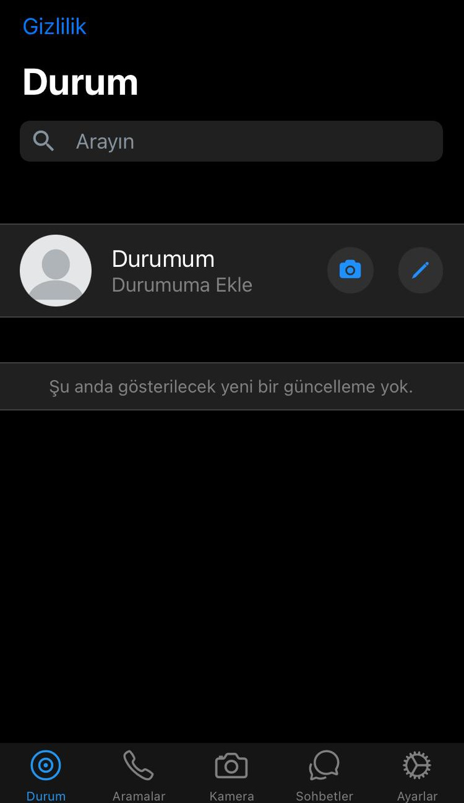
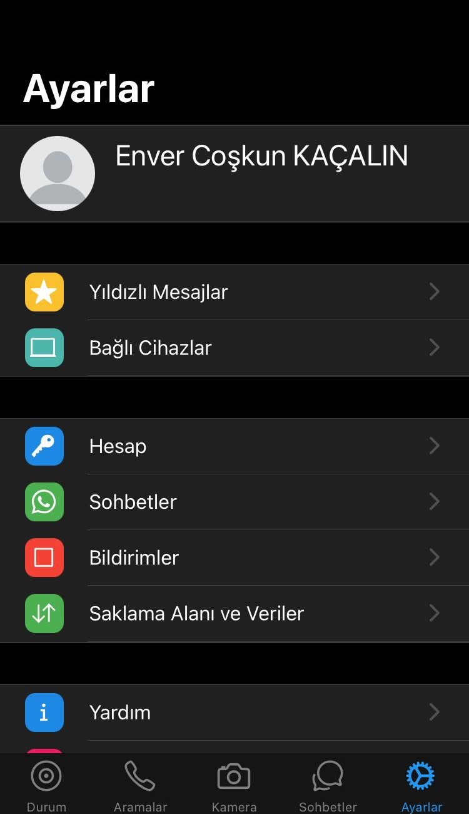
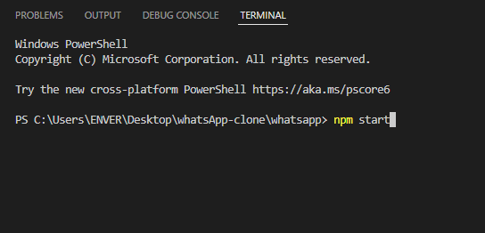

<p align="center">
  
</p>

#

<p align="center" >
  
   
</p>


# WhatsApp-Clone
A whatsapp clone developed with Expo.

It is designed for phones with iOS operating system.

# Installation

- Install [Node.js](https://nodejs.org/en/download/) 

- Install Npm in terminal.

```
npm install
```
 
- [Expo CLI](https://docs.expo.dev/get-started/installation/)

  Install Expo CLI using terminal

```
npm install --global expo-cli
```
- Install the Expo Go app on your mobile device

# Start The Application

Type  ```npm start``` in the terminal.



Show the generated QR code to the phone camera and run it with Expo Go.

The application works on both Andoid and iOS, but since it is designed for iOS run it on iOS devices.

# Author

- [Enver Coşkun KAÇALIN](https://github.com/enverkacalin)

-----
